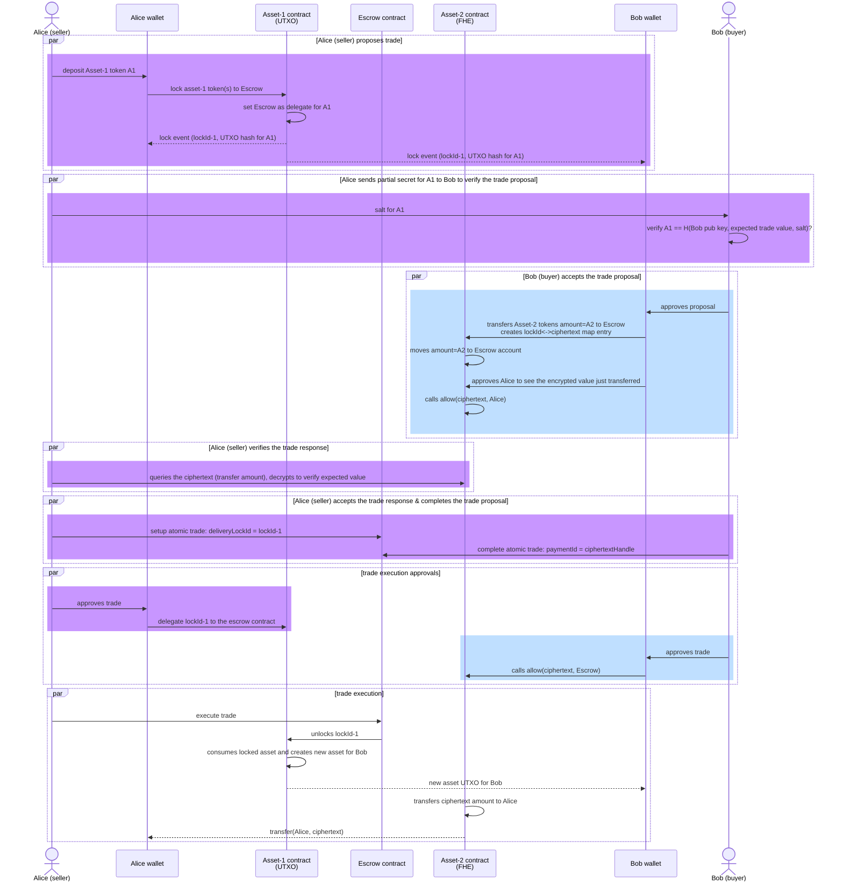
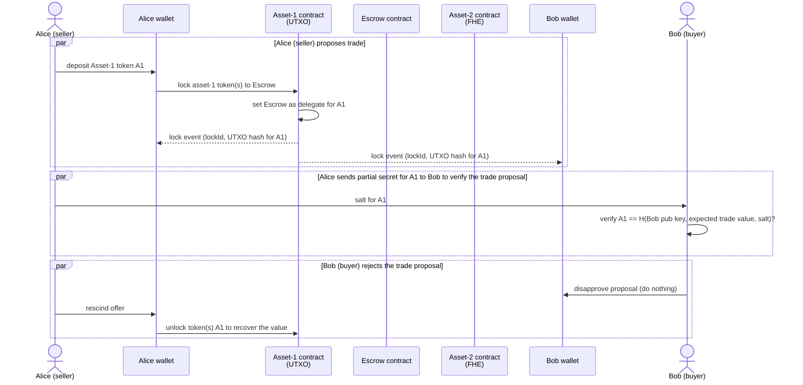
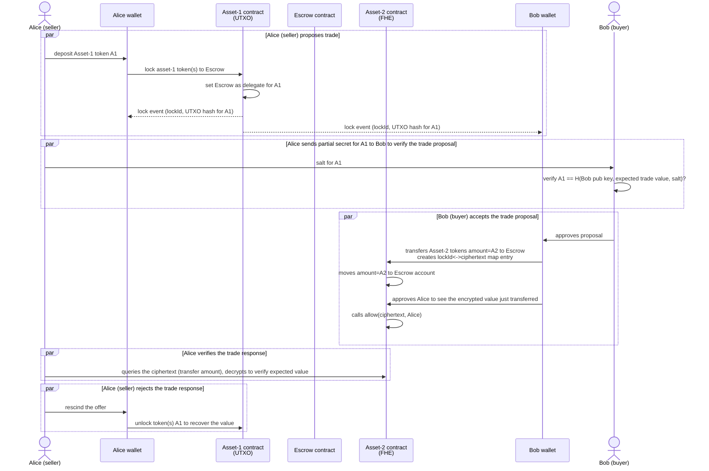

# Demonstrations of DvP patterns b/w Privacy Tokens

This project demonstrates a number of DvP patterns for atomic settlement between transfers of privacy preserving tokens.

## Different Designs of Pivacy Token implementations

Two major designs of privacy preserving tokens are covered:

- Fully Homomorphic Encryption (FHE) based. This category of tokens tend to use an account model for managing the onchain states, where a map of account addresses and encrypted balances is maintained by the token contract. In particular, the Confidential ERC20 tokens implemented in https://github.com/OpenZeppelin/openzeppelin-confidential-contracts/tree/master based on Zama was used in the example.
- Commitment based. This category of tokens tend to use a UTXO model for the onchain states, where each UTXO is a hash-based commitment to the secrets of the token (owner, value). Exmaples of this design pattern include Zcash, Railgun, and LFDT Paladin's Noto and Zeto tokens.

## DvP Pattern 1: Confidential ERC20 with deposit in escrow vs. Zeto with locking

The flows for the secure exchange of tokens between two parties, one using a vanilla Confidential ERC20 token, another using a UTXO based privacy token that supports locking.

### Propose -> Accept -> Approve -> Execute

### Seller Proposes -> Buyer Rejects

### Seller proposes -> Buyer accepts & responds -> Seller rejects response

### Propose -> Accept -> Seller approves & Buyer disapproves

[to be continued]

## DvP Pattern 2: Confidential ERC20 with locking vs. Zeto with locking

The flows for the secure exchange of tokens between two parties, one using a Confidential ERC20 token enhanced with locking, another using a UTXO based privacy token that supports locking.

[to be continued]
