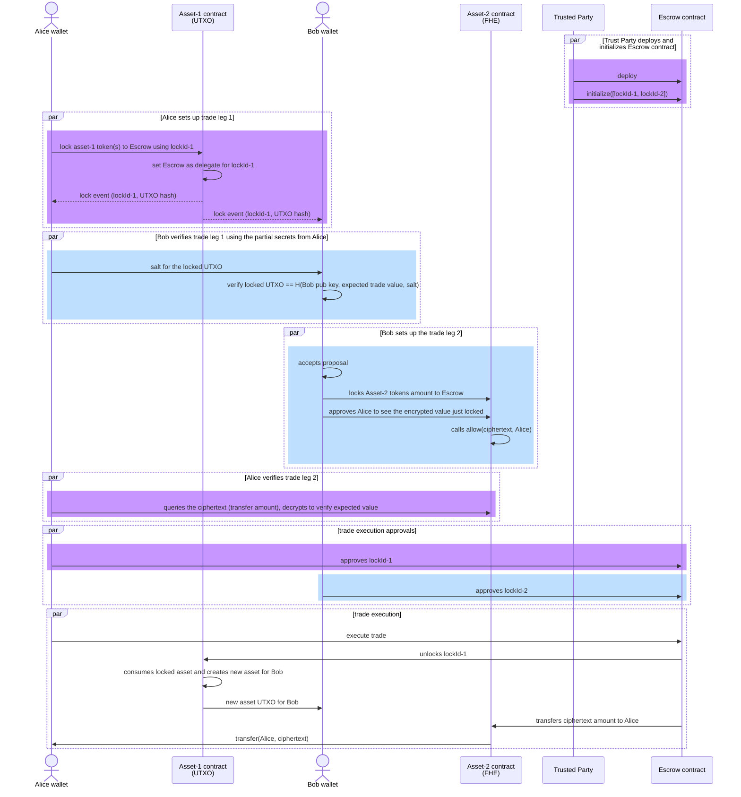
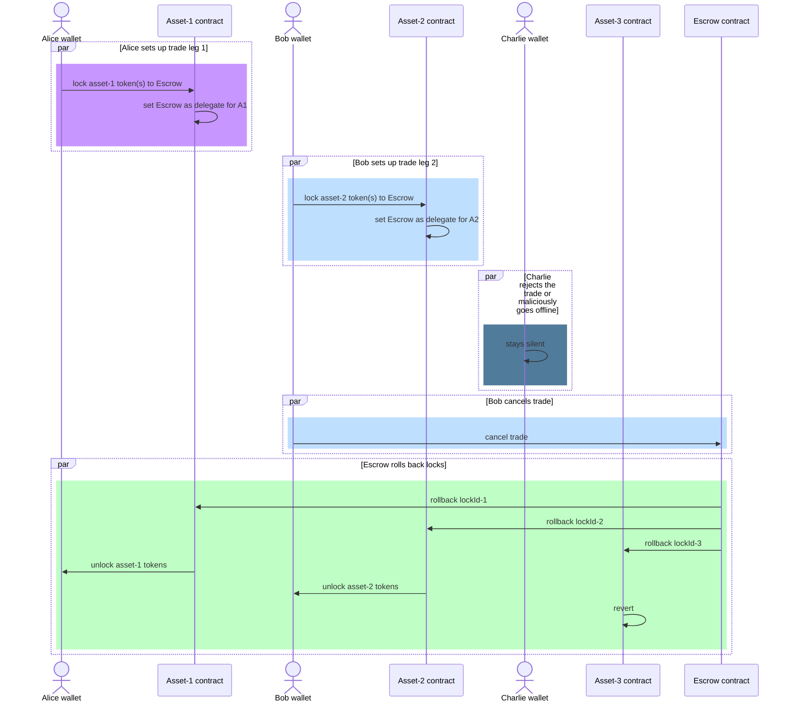
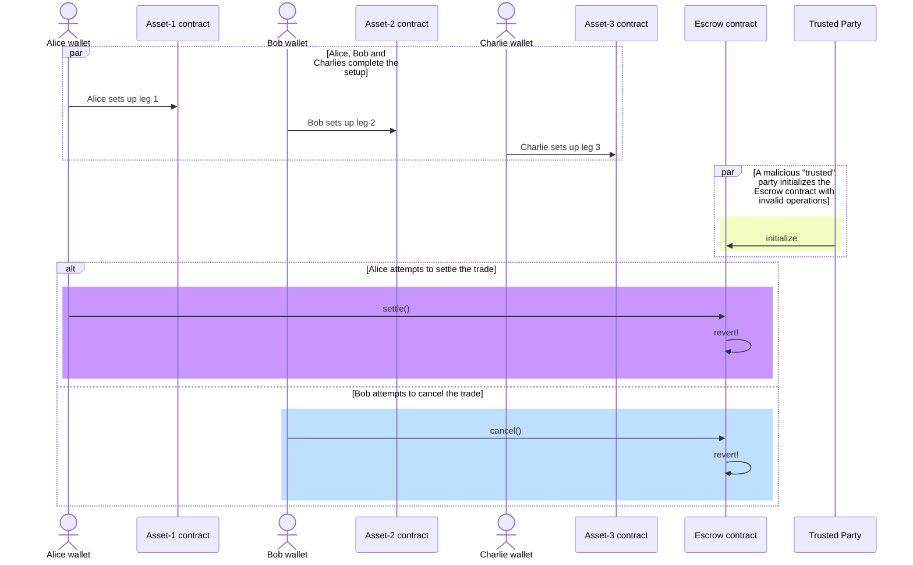

# Secure Multi-leg Atomic Settlements of Privacy Enhancing Tokens

## Table of Contents

- [The Privacy Enhancing Tokens Landscape](#the-privacy-enhancing-tokens-landscape)
  - [Homomorphic Encryption based Tokens](#homomorphic-encryption-based-tokens)
  - [Commitment based Tokens](#commitment-based-tokens)
    - [Hash (non-homomorphic) based Commitments](#hash-non-homomorphic-based-commitments)
    - [Homomorphic Commitments](#homomorphic-commitments)
- [Atomic Settlements b/w Privacy Tokens](#atomic-settlements-bw-privacy-tokens)
  - [Lock interfaces for the privacy tokens](#lock-interfaces-for-the-privacy-tokens)
  - [Generic lock interface](#generic-lock-interface)
  - [Settlement orchestration contract](#settlement-orchestration-contract)
  - [Successful Settlement Flow #1 - Confidential ERC20 vs. Confidential UTXO](#successful-settlement-flow-1-confidential-erc20-vs-confidential-utxo)
  - [Failure case #1 - counterparty fails to fulfill obligations during setup phase](#failure-case-1-counterparty-fails-to-fulfill-obligations-during-setup-phase)
  - [Failure case #2 - a malicious party attempting to initialize with invalid Operations](#failure-case-2-a-malicious-party-attempting-to-initialize-with-invalid-operations)

This document proposes an ERC for performing multi-leg settlements among an arbitrary number of privacy-enhancing tokens in a secure and atomic manner.

## The Privacy Enhancing Tokens Landscape

A number of privacy enhancing token designs exist in the Ethereum ecosystem today. This proposal is designed to accommodate different styles of privacy token designs. Below we briefly review the two mainstream designs of privacy enhancing tokens, along with some influential implementations for each.

### Homomorphic Encryption based Tokens

This category of tokens protects the confidentiality of onchain states and transaction payloads through encryption. In particular, homomorphic encryption enables operations to be performed onchain against the states. These encryption schemes allow smart contracts to operate on ciphertexts and, more importantly, to enforce spending policies such as mass conservation and non-negative balances, purely through onchain components.

> We are using the term "onchain components" above in a loose sense. Some essential components like the co-processor for performing the computation-intensive FHE operations may be considered trusted offchain components. But given they are part of the "protocol" setup, rather than requiring client-side or wallet-side components like is the case with commitment-based tokens, we call them "onchain components" for brevity.

This category of tokens typically uses an account model for managing onchain states, where a map of account addresses and encrypted balances is maintained by the token contract.

The encryption scheme must be a fully homomorphic encryption (FHE) system, to support all the necessary operations onchain, including arithmetic comparisons that are crucial to enforce token spending policies, without requiring clients to submit proofs of correct encryption.

Implementations of encryption based tokens include:

- OpenZeppelin’s [ERC7984 implementation](https://github.com/OpenZeppelin/openzeppelin-confidential-contracts/tree/master/contracts/token)
- Inco's [Confidential ERC20 framework](https://github.com/Inco-fhevm/confidential-erc20-framework/tree/main), in collaboration with Circle Research
- Fhenix's [FHERC20](https://github.com/FhenixProtocol/fhenix-contracts/blob/main/contracts/experimental/token/FHERC20/FHERC20.sol)

The samples in this repo are built with the 1st implementation on the list above.

### Commitment based Tokens

This category of tokens protect the confidentiality of the onchain states and transaction payloads by using commitments. The commitments represent the onchain states either with hashing or encryption. When processing transactions, the smart contract relies either completely or partially on a ZKP submitted by the sender to guarantee correctness of the state transitions.

#### Hash (non-homomorphic) based Commitments

If the commitments are based on hashes, no operations can be performed on the commitments during state transition. The smart contract must completely rely on a ZKP submitted by the transaction sender to verify if the state transitions are proposed correctly, obeying all spending rules such as mass conservation and entitlement.

Due to the disjoint nature of the commitments, the state model is inevitably **UTXO** (Unspent Transaction Output) based. This model has the advantage of supporting parallel processing, where the same spending account can submit many transactions simultaneously, each consuming a different collection of the account's UTXOs. This means these tokens do not suffer from the concurrent spending limits that tokens based on homomorphic commitments (described below) do.

Many privacy tokens fit in this category, including:

- Zcash
- Railgun
- Aztec
- LFDT's Paladin's [Noto](https://github.com/LFDT-Paladin/paladin/tree/main/solidity/contracts/domains/noto) and [Zeto](https://github.com/LFDT-Paladin/zeto) tokens

The samples in this repository are built with the Zeto token implementation.

#### Homomorphic Commitments

If the commitments are based on additive homomorphic encryption, or homomorphic commitment (such as Pedersen commitment), the smart contract can perform additions on the commitments. However, the smart contract must still rely on ZKPs to guarantee correctness of the calculated commitments, such as mass conservation and entitlement. The homomorphic property of the commitment scheme makes it possible to "roll up" all the state commitments for an account to a single commitment, rather than staying as individual commitments, thus resulting in more efficient storage usage. However, these token designs suffer from limited throughput due to the concurrency requirement between the proof-generating client and the onchain verification logic.

Examples include:

- [Zether](https://github.com/Consensys/anonymous-zether), based on additively homomorphic encryption with ElGamal
- Solana's [Confidential Transfer](https://www.solana-program.com/docs/confidential-balances), based on Pedersen commitments
- Avalanche's [Encrypted ERC-20](https://github.com/ava-labs/EncryptedERC), based on a custom partially homomorphic encryption scheme

## Atomic Settlements Between Privacy Tokens

To demonstrate atomic settlements among privacy tokens, exemplary token implementations are selected to represent the major design patterns in the current privacy-enhancing tokens landscape, as described above. In particular, an implementation from the FHE-based design was selected—OpenZeppelin's Confidential ERC20—and an implementation from the commitment-based design was selected—LFDT's Zeto token.

Among the two tokens, 3 types of settlement flows can be implemented:

- Confidential ERC20 vs. Confidential ERC20
- Confidential ERC20 vs. Zeto
- Zeto vs. Zeto

The examples in this repository demonstrate that **_a generic locking-based settlement mechanism_** can be developed to support the major design patterns of privacy-enhancing tokens in multi-leg atomic settlement flows.

### Lock interfaces for the privacy tokens

The repository contains the following smart contract interfaces that need to be implemented in the privacy token contract to make the settlement flow work:

- `ILockableConfidentialERC20`: as a demonstration for how Confidential ERC20 token implementations can be enhanced to support locking, where a portion of an account's balance is locked during the settlement period, such that only the designated `delegate` account can perform transfers on the locked amount. During the lock period, even the account owner is prevented from transferring the locked amount, thus keeping the committed values for a proposed trade/swap safe until settlement time.

```solidity
function createLock(bytes32 lockId, address receiver, address delegate, externalEuint64 amount, bytes calldata proof, bytes calldata data) external;
function delegateLock(bytes32 lockId, address newDelegate, bytes calldata data) external;
```

- `ILockableConfidentialUTXO`: as a demonstration of how commitments based token implementations can support locking.

```solidity
function createLock(
    bytes32 lockId,
    LockParameters calldata parameters,
    bytes calldata proof,
    address delegate,
    LockOperationData calldata settle,
    LockOperationData calldata rollback,
    bytes calldata data
) external;

function delegateLock(
    bytes32 lockId,
    address newDelegate,
    bytes calldata data
) external;
```

There are slight differences in the function signature due to the different onchain state model used by account-based tokens vs. UTXO-based tokens. But the locking mechanism is the same and works as follows:

- A lock must be created in a one-time opportunity with `createLock` and cannot be modified except for changing the delegate. This is done for safety reasons: we do not want the trading counterparty to cheat by redirecting the locked funds elsewhere after we have committed our part of the trade agreement.
- The `createLock` function should be carefully implemented to guarantee true locking, such that the locked assets cannot be transferred again except for the lock's settlement or rollback.
- The trade counterparty must be able to inspect the createLock transaction and verify that the `settle` operation represents the intended asset value and movement, as agreed upon. Given the confidential (and anonymous in the case of certain token implementations) nature of the token, the ability to fully verify may depend on secret sharing from the asset owner via out-of-band channels. This is dependent on the specific token implementation.
- The `delegate` is an important concept for the lock mechanism to work. This is the only party that can carry out the intended operations to settle, or to rollback either when the trade falls apart (one of the counterparties failed to fulfill their commitment), or when the settlement fails to execute. Typically the delegate should be a smart contract, with trusted processing logic to settle and to rollback under the expected conditions.

### Generic lock interface

Both of the above interfaces extend the following **_generic lock interface_**. This interface describes the minimal behavior of a lock that must be consistently implemented by a privacy token, in order to work with the settlement orchestration contract to drive the settlement or rollback operations against the privacy tokens:

- `ILockable`: with a simple interface that provides two functions, `settleLock` and `rollbackLock`, to be called to either proceed with settlement or to rollback. Each operation uses the `lockId` to signal to the target privacy token contract the lock to operate on.

```solidity
function settleLock(bytes32 lockId, bytes calldata data) external;
function rollbackLock(bytes32 lockId, bytes calldata data) external;
```

The above generic interface is expected to work with all privacy tokens that have implemented a lock interface to allow settle and rollback flow to be deterministically driven by a lock ID.

### Settlement orchestration contract

Finally, a settlement orchestration contract implementation, `Atom`, is provided. The Atom contract must be initialized once with all the legs of the settlement, with each leg represented by an `Operation` object.

```solidity
function initialize(Operation[] memory _ops) external initializedOnlyOnce onlyOwner
```

The `initialize()` function is the one-time opportunity to put the different legs of a settlement in the contract. This is designed for security reasons: otherwise, we do not know what the expected list of participants in the trade is, and as such cannot prevent a random party (with malicious intent) from appending an invalid Operation and invalidating the setup.

This design assumes that necessary negotiations and orchestrations will happen ahead of time, with each of the trading participants having verified the setup of the locks in the relevant token contracts. A trusted party can then call the `initialize()` function on behalf of all the trading participants. The trusted party can either be a smart contract or an externally owned account (EOA) held by a mutually trusted entity.

After the `initialize()` call, each of the trading parties must be given an opportunity to review the initialized operations by checking that the `lockId` and the `approver` are correct, and that the corresponding locks on the respective token contracts are securing the expected amount of assets for the trade. Then each of the trading parties should signal their approval to the escrow contract. Only after all approvals are given should the `settle()` function be allowed to execute.

On the other hand, any of the trading parties should be allowed to call `cancel()` on the orchestrator contract, before all the approvals are given. This prevents a malicious party from holding up the settlement by staying silent.

### Successful Settlement Flow #1 - Confidential ERC20 vs. Confidential UTXO

The diagram below illustrates a full settlement flow that results in the successful settlement between two trading participants: one (Alice) using a Confidential UTXO token and one (Bob) using a Confidential ERC20 token.



### Failure case #1 - counterparty fails to fulfill obligations during setup phase

The locking mechanism must have safety features that protect against the following failure scenarios. A failure scenario can either be due to an intentional decision against the proposal, or malicious action to fail to fulfill required obligations.

Because the proposed mechanism focuses on intra-chain settlements only, meaning all the target tokens are deployed on the same chain, the risks are all in the setup phase, where each counterparty is expected to fulfill their side of the bargain obligation. Once the setup is complete and approved, the final settlement happens atomically, guaranteed by the underlying blockchain protocol.



To support this scenario:

- The Escrow contract must allow a partially set up trade to be cancelled, but only by the trade participants as designated by the list of Operations.

### Failure case #2 - a malicious party attempting to initialize with invalid Operations

A malicious party can initialize the escrow contract with an invalid operation, such that it will always fail either on `settle()` or `cancel()`. This results in the honest parties' locked assets to stay locked forever, because they have been committed to be only settled or rolled back by the escrow contract, which is now compromised.



To guard against this case:

- The escrow contract initialization must happen first, then each of the trade legs is set up, using the lockIds proposed in the list of operations passed to `initialize()`.
- The `cancel()` function of the escrow contract must be implemented to catch reverts in the downstream calls to the token contracts' `rollbackLock()` function. Otherwise, a malicious participant can implement a lock that reverts on rollback and prevents other participants from getting back their locked assets.
